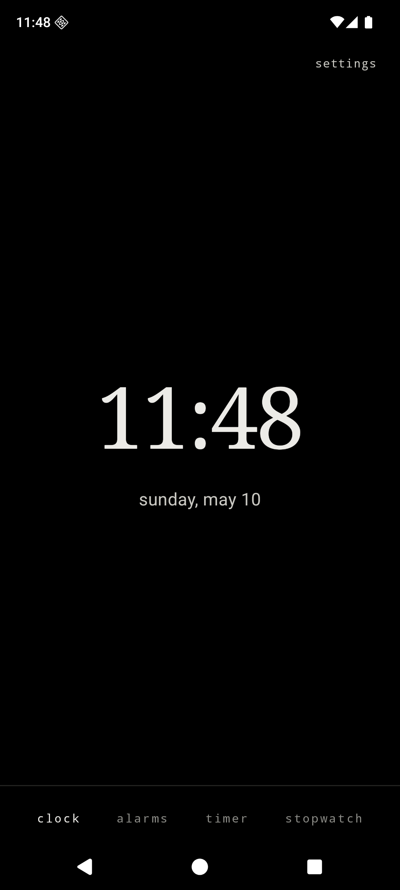
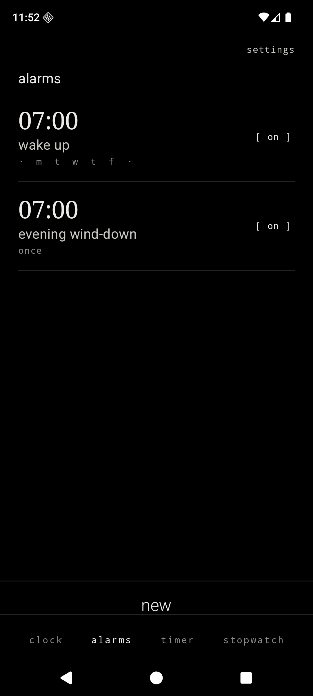
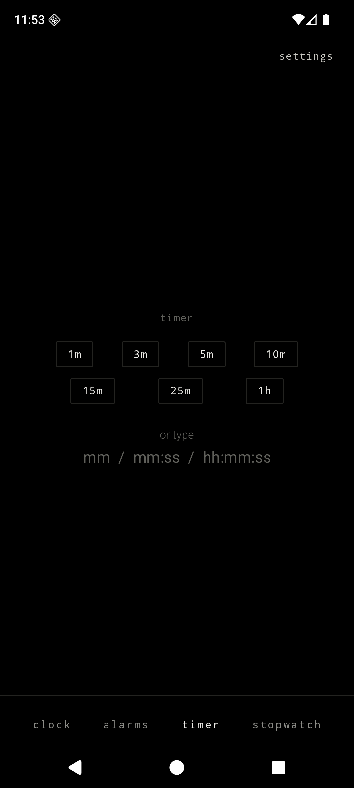
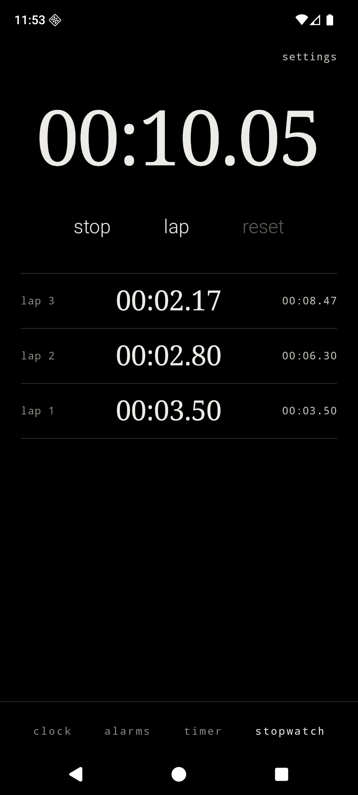

<div align="center">

# Still Clock

#### A quiet clock, alarms, timer, and stopwatch for Android.

part of the [still](STILL.md) family. the pact governs every line of code in this repo.

<br>

&nbsp;&nbsp;&nbsp;

<br>

</div>

---

Still Clock is a minimalist, privacy-first Android clock app. It is monochrome, OLED-first, text-first, and designed to feel like the clock app a beautiful dumb phone would ship if it had a touchscreen. It is the companion to [Still](../still-launcher), [Still Notes](../still-notes), and [Still Cal](../still-cal) — same temperament, same fonts, same refusal to phone home.

Still Clock declares no internet permission. It ships no analytics. It depends on neither Firebase nor Google Play Services. Alarms persist as one JSON blob in DataStore-Preferences, parsed in-house by `org.json` — no third-party serialization library, no third-party alarm or timer library. It runs on any Android device from API 26 up.

It also subsumes the original `still-bedtime` idea: the per-alarm `soft` toggle ramps tone volume from silent to the system alarm-stream level over thirty seconds. That is the entirety of the bedtime surface — no sleep tracking, no wind-down "stories", no breathwork loops, no grayscale schedule.

## What Still Clock does

- A **clock tab** — large serif live time, today's date in sans below it (`tuesday, may 12`), an optional second-zone strip below that for one IANA zone you set in settings.
- An **alarms tab** — vertically scrolling list of alarms. Each row shows time in serif, label in sans, days-of-week as a 7-letter mono row, and a text on/off toggle (`[ on ]` / `[ off ]`). Tap to edit. Long-press for an `edit` / `delete` action sheet. Footer verb: `new`.
- An **alarm-fires Activity** — full-screen, over the lockscreen, with the alarm time in serif, the label in sans below, and two oversized lowercase verbs at the bottom (`dismiss`, `snooze`). Launched directly by the receiver and via the high-importance notification's full-screen intent. System back is a no-op.
- A **timer tab** — a single countdown. Seven duration chips (`1m`, `3m`, `5m`, `10m`, `15m`, `25m`, `1h`) plus a single-line text field accepting `Mm`, `Mm:Ss`, or `Hh:Mm:Ss` formats. Running shows a serif `MM:SS` (or `HH:MM:SS`) with `pause` / `cancel`; paused shows `resume` / `cancel`; finished shows `time up` and `dismiss`.
- A **stopwatch tab** — serif `HH:MM:SS.cc` readout, three lowercase verbs (`start`, `lap`, `reset`). Lap list scrolls below; each row shows lap number, lap split, and total elapsed.
- A **bottom tab strip** — four lowercase mono labels pinned to the bottom of every primary screen. Active tab is `SoftWhite`, others are `Gray`. Color is the only emphasis. Fade-only transitions.
- A **settings tab access** — top-right corner of every primary screen, a lowercase `settings` verb in mono.
- Font presets shared with the rest of the Still ecosystem: **System** (serif + sans + mono), **Editorial** (Cormorant + Inter + Plex), **Terminal** (Plex Mono throughout), **Grotesk** (Instrument Serif + Space Grotesk).

## What Still Clock refuses to do (and what it asks for honestly)

- No `INTERNET` permission. Ever.
- No analytics, no telemetry, no Firebase, no Google Play Services, no ads.
- No alarm-sound library; four bundled CC0 `.ogg` tones plus the system alarm ringtones via `RingtoneManager`. That's it.
- No alarm gimmicks: no math-puzzle dismiss, no shake-to-snooze, no photo-of-bathroom-to-dismiss, no scan-the-shampoo-barcode-to-dismiss.
- No widgets, no quick-settings tile, no app shortcuts, no Tasker integration, no notification-listener service, no accessibility service.
- No multiple simultaneous timers. One timer is one timer. If you want two, use the alarm tab.
- No analog clock face. Typographic only.
- No NTP sync, no atomic-clock pulls, no time-zone download.
- No `+` button. New alarms are reached via the `new` footer verb.

Seven permissions ARE declared because they are unavoidable for a clock app whose alarms have to fire over a locked screen. None of them involves the network. None pulls a third-party SDK.

| Permission | Why it's needed |
| --- | --- |
| `POST_NOTIFICATIONS` | Android 13+ runtime requirement to surface alarm and timer notifications. Asked the first time you enable an alarm or start a timer. |
| `SCHEDULE_EXACT_ALARM` | Android 12 / 12L runtime requirement for `AlarmManager.setAlarmClock` and the timer's `setExactAndAllowWhileIdle`. An alarm that fires ten minutes late is broken. |
| `USE_EXACT_ALARM` | Android 13+ exact-alarm declaration for apps whose core purpose is alarms and timers, avoiding a first-run trip through special app access settings. |
| `RECEIVE_BOOT_COMPLETED` | `AlarmManager` forgets every armed alarm across reboots; without this every alarm dies overnight. |
| `USE_FULL_SCREEN_INTENT` | Android 14+ requires this manifest declaration to launch the alarm-fires Activity over the lockscreen via the notification's full-screen intent. |
| `WAKE_LOCK` | Keep the CPU and screen alive while the alarm is ringing so the tone, vibration, and dismiss/snooze UI stay responsive. |
| `VIBRATE` | Vibrate alongside the tone — the only haptic surface in the app. |

## Privacy posture, in code

| File | What it guarantees |
| --- | --- |
| `app/src/main/AndroidManifest.xml` | Seven alarm-related permissions disclosed with comments; zero networking permissions; two `BroadcastReceiver`s and one extra `Activity`, all not exported except the boot receiver |
| `app/src/main/res/xml/data_extraction_rules.xml` | Excludes every sharedpref / file / database domain from cloud backup and device transfer |
| `app/build.gradle.kts` | Dependencies only on AndroidX, Compose, and DataStore — no Firebase, no GMS, no analytics SDK, no alarm/timer library |

## Architecture

```text
MainActivity
└── StillClockApp                          single-Activity Compose shell, hand-rolled router
    ├── AlarmsRepository                   DataStore-backed Alarm list, JSON-encoded blob
    ├── TimerRepository                    DataStore-backed TimerState, single source of truth
    ├── StopwatchRepository                DataStore-backed StopwatchState, single source of truth
    ├── PreferencesRepository              DataStore — font, time format, seconds, second zone, default tab, sound, snooze
    ├── alarm
    │   ├── AlarmScheduling                pure functions: next-occurrence math, snooze offsets, soft-ramp coefficient
    │   ├── AlarmsScheduler                AlarmManager.setAlarmClock + cancel + snooze
    │   ├── TimerScheduler                 setExactAndAllowWhileIdle + DataStore mutations
    │   ├── AlarmReceiver                  notification + start AlarmFiresActivity, schedule next occurrence
    │   ├── BootReceiver                   BOOT_COMPLETED → reschedule everything
    │   └── AlarmFiresActivity             full-screen, over-lockscreen, dismiss/snooze, soft-ramp
    └── Compose surfaces
        ├── ui/clock/ClockScreen           live serif clock, date, optional second zone
        ├── ui/alarms/AlarmsScreen         list of alarms, per-row toggle, action sheet
        ├── ui/alarms/AlarmEditScreen      time picker, label, days, soft, save
        ├── ui/timer/TimerScreen           chips → running → paused → finished
        ├── ui/stopwatch/StopwatchScreen   readout, start/stop/lap/reset, lap list
        ├── ui/settings/SettingsScreen     font, time format, seconds, zone, default tab, sound, snooze
        └── ui/components/                 StillDivider, StillTabBar, StillMenuItem, StillToggle, StillNumberPicker
```

Kotlin, Jetpack Compose, AGP 9.2.1, Gradle Kotlin DSL. Everything lives in a single DataStore-Preferences file (`stillclock.preferences_pb`) — alarm list, timer state, stopwatch state, all settings. Navigation Compose is intentionally avoided; a small sealed-class `Route` lives in `StillClockApp.kt`. Alarm scheduling is `AlarmManager.setAlarmClock` (the OS's user-facing alarm slot, which paints the status-bar alarm icon and survives Doze). Timer scheduling is `setExactAndAllowWhileIdle(ELAPSED_REALTIME_WAKEUP)`, with the wall-clock deadline kept only as a reboot recovery fallback. The alarm-fires Activity is launched two ways: directly from the receiver (preferred) and via the high-importance notification's full-screen intent (the fallback Android 14+ requires).

## Gestures

| Gesture | Effect |
| --- | --- |
| Tap a tab in the bottom strip | Switch to that primary screen |
| Tap an alarm row | Open alarm editor for that alarm |
| Long-press an alarm row | Action sheet — edit, delete |
| Tap the on/off text toggle | Toggle alarm enabled (no edit) |
| Tap a duration chip (timer) | Start the timer at that duration |
| Tap a day letter (alarm edit) | Toggle that day in the alarm's repeat set |
| Tap the time digits (alarm edit) | Reveal inline numeric picker |
| Tap `start` / `stop` / `lap` / `reset` | The named action |
| Tap `dismiss` (alarm fires) | Stop tone+vibration, schedule next occurrence (recurring) or disable (one-shot), finish |
| Tap `snooze` (alarm fires) | Stop tone+vibration, schedule snooze N minutes out, finish |
| System back (alarm fires) | No-op — must dismiss or snooze |
| System back (anywhere else) | One step back along the route stack |

## Design language

- OLED black background. Soft white primary text. Gray secondary text. Hairline (`#232320`) dividers.
- Serif for the live clock, time digits, lap times. Sans-serif for labels, settings rows, footer verbs. Monospace for kickers, captions, day-of-week letters, the picker numerals.
- Lowercase for verbs (`new`, `save`, `delete`, `cancel`, `back`, `start`, `stop`, `lap`, `reset`, `pause`, `resume`, `dismiss`, `snooze`). Title case only when you typed it yourself.
- No ripple. Fade-only transitions (200ms `Crossfade`). No bouncy motion. No accent color.
- The on/off toggle is text (`[ on ]` / `[ off ]`), not a Material Switch. The active tab in the bottom strip is `SoftWhite`, not a chip — color is the only emphasis.
- Open-source fonts shipped under their respective OFL licenses: IBM Plex Mono, Inter, Cormorant Garamond, Instrument Serif, Space Grotesk.

## Build and install

Requirements: **JDK 17**, the **Android SDK** with `platforms;android-36` and `build-tools;36.0.0`. The Gradle wrapper (9.4.1) is bundled.

```bash
./gradlew assembleDebug
adb install -r app/build/outputs/apk/debug/app-debug.apk
```

The bundled tones (`app/src/main/res/raw/still_chime.ogg`, `still_pulse.ogg`, `still_bell.ogg`, and `still_wood.ogg`) are generated by `sox` per the recipe in `app/src/main/res/raw/still_tone_license.txt` so the licensing is unambiguously CC0. If absent at runtime, the alarm-fires Activity gracefully falls back to the user-selected ringtone, then to the system default alarm ringtone, then to vibration alone.

## Notes for GrapheneOS

Still Clock depends on no part of Google Play Services. Alarms fire via `AlarmManager.setAlarmClock`, the OS's user-facing alarm slot — no Doze allowlist needed, no battery-optimization exemption requested. The alarm-fires Activity uses `setShowWhenLocked(true)` and `setTurnScreenOn(true)` plus the high-importance notification's full-screen intent, both of which work on a fresh GrapheneOS profile.

## Status

MVP. Builds against AGP 9.2.1 / Kotlin 2.3.21 / `compileSdk 36`. Scheduling math (next-occurrence for one-shot and recurring alarms, snooze offset, soft-mode ramp coefficient) is unit-tested. End-to-end emulator validation against §13 of `spec.md` is the maintainer's next step.

## License

MIT. See [`LICENSE`](LICENSE).
